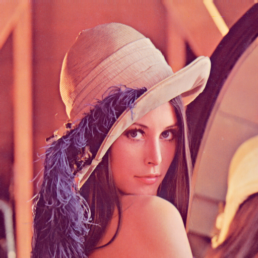
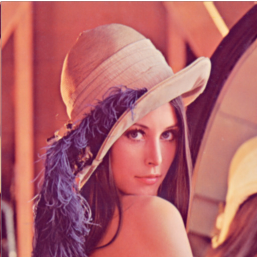

# CUDA Image Processing: Gaussian Blurring
This course project implements a Gaussian blurring operation on images using CUDA, achieving processing solely on the GPU for the 'CUDA at Scale for the Enterprise' course. The project outputs the blurred images after processing.

## Project Description
Gaussian blurring is a technique used in image processing to reduce image noise and smoothen out details. Noise can negatively impact images by introducing pixel brightness or color, which can reduce the image's precision. Gaussian blurring aims to reduce this noise by averaging the color values of a pixel with its surrounding pixels. This creates a smoother overall image by blending slight variations and evening out the noise.

Gaussian blurring is a widely used technique because it offers a good balance between noise reduction and detail preservation. It can be applied to various image processing tasks, like:
- Portrait photography: Smoothing skin imperfections for a more flattering look.
- Background softening: Creating a bokeh effect by blurring the background behind a subject.
- Image scaling: Reducing noise introduced when shrinking an image.
- Noise reduction: Removing unwanted grain or speckles from photographs..

## Example 

The below (left) is the input images and output image is on right.





## Code Organization

```bin/```
This folder should hold all binary/executable code.

```images/```
This folder contains both the original example images and the output blurred images. 
```lib/```
This project utilizes the `stb` image library (http://nothings.org/stb/), developed by Sean Barrett (2010-2015), to read images into array format and write processed images as files. 

```src/```
The source code should be placed here in a hierarchical fashion, as appropriate.

```Makefile```
- Compile the CUDA code by running `make clean` build in your terminal. This clears any previous builds and creates the executable gaussian_blur.exe.

- Running the Program by running `make all`. The make all command typically builds and then executes the program.

```run.sh```
An optional script used to run your executable code, either with or without command-line arguments.
